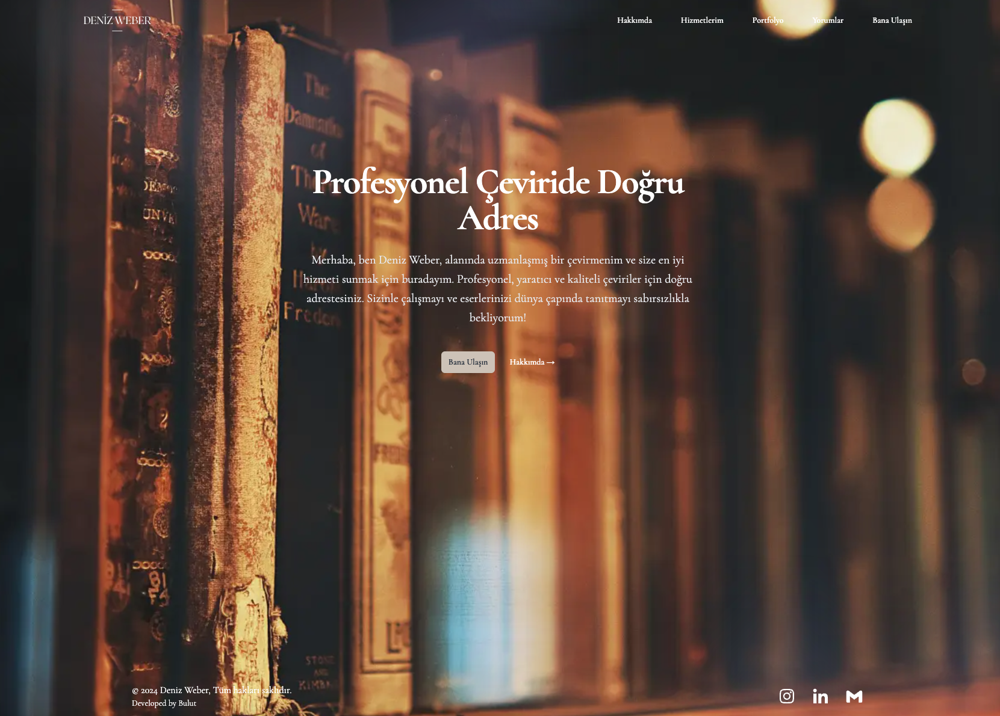

## About the Website

I created this website for **Deniz Weber**, a professional book translator. The project aimed to build a sleek and user-friendly online portfolio to showcase her work and facilitate client interactions.

### Project Goals

- **Showcase Portfolio**: Display Deniz Weber’s translation projects and expertise.
- **Client Interaction**: Provide an easy way for potential clients to contact her.

### Key Features

- **Professional Portfolio**: Showcases various translation projects.
- **Testimonials Section**: Displays testimonials from authors whose books she has translated.
- **Contact Form**: Allows potential clients to reach out directly through the website.
- **About Section**: Features an image and a personal introduction from Deniz Weber.
- **Responsive Layout**: Optimized for both desktop and mobile views.

### Technologies Used

- **Next.js**
- **Tailwind CSS**
- **Sanity.io**: Implemented as the CMS for managing and updating website content.

You can see the live website at: [https://www.denizweber.com](https://www.denizweber.com)
